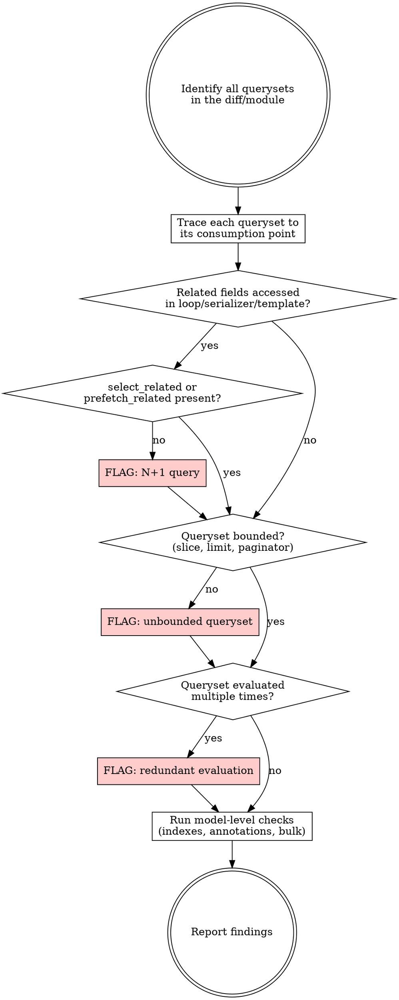

# Reviewing Query Performance

## Overview

Systematic review of Django ORM usage to catch N+1 queries, missing prefetch optimization, unbounded querysets, and model-level performance issues before they reach production. Review follows a checklist that traces every queryset from its origin (view/task/service) through serialization and template rendering.

## When to Use

- Reviewing a PR or diff that touches views, serializers, services, or models
- Auditing an existing module for query performance
- Adding a new model relationship (ForeignKey, ManyToMany)
- Debugging slow pages or high query counts

## Review Process



## Checklist

### 1. N+1 Query Detection

Trace every loop, serializer method field, and template `` that touches a queryset. For each related field accessed inside the loop body, verify the queryset was prepared with the right prefetch.

| Access pattern | Required optimization |
|---|---|
| `obj.foreign_key_field` (single object) | `select_related('field')` on the queryset |
| `obj.foreign_key_field.nested_fk` | `select_related('field__nested_fk')` |
| `obj.many_to_many.all()` | `prefetch_related('m2m_field')` on the queryset |
| `obj.reverse_fk_set.all()` | `prefetch_related('reverse_fk_set')` on the queryset |
| `obj.reverse_fk_set.filter(...)` | `Prefetch('reverse_fk_set', queryset=...)` with the filter baked in |
| Annotation-dependent property | Annotation must be on the queryset, not computed per-row |

**Where to look:**
- `SerializerMethodField` implementations (`get_*` methods) - each one can hide a query
- Template `{{ obj.related.field }}` and ``
- List comprehensions and generator expressions over querysets
- Service functions called per-item in a loop
- Signal handlers triggered per-save in a `bulk_create` (signals fire per object)

**Serializer-specific pattern (good):**
```python
# Defensive prefetch check - avoids silent N+1
def get_member_count(self, obj):
    if hasattr(obj, '_prefetched_objects_cache') and 'members' in obj._prefetched_objects_cache:
        return len(obj.members.all())  # hits cache
    return obj.members.count()  # single COUNT query fallback
```

### 2. Unbounded Querysets

Any queryset that could return thousands of rows must be bounded. Check:

- **Views returning lists:** must paginate or slice (`[:limit]`)
- **Prefetches on large reverse relations:** consider adding `.order_by(...)[:N]` inside the `Prefetch` queryset
- **Admin/management commands:** acceptable to be unbounded if one-shot
- **Celery tasks processing "all" rows:** must chunk with `iterator(chunk_size=...)` or explicit batching

### 3. Redundant Evaluation

A queryset re-evaluates on each access unless cached. Watch for:

```python
# BAD - two queries
if qs.count() > 0:
    items = list(qs)

# GOOD - one query
items = list(qs)
if items:
    ...
```

```python
# BAD - evaluates twice (len + iteration)
total = len(qs)
for item in qs:
    ...

# GOOD - evaluate once
items = list(qs)
total = len(items)
```

Also check: `qs.count()` when only checking emptiness (use `.exists()` instead).

### 4. Python-Level Filtering

Filtering in Python after fetching all rows wastes bandwidth and memory:

```python
# BAD - fetches all, filters in Python
all_messages = Message.objects.all()
unread = [m for m in all_messages if not m.is_read]

# GOOD - filter at DB level
unread = Message.objects.filter(is_read=False)
```

Same applies to: sorting in Python (`sorted(qs, key=...)` instead of `.order_by()`), aggregating in Python (`sum(obj.amount for obj in qs)` instead of `.aggregate(Sum('amount'))`).

### 5. Model-Level Checks

**Indexes:**
- Every field used in `.filter()`, `.exclude()`, `.order_by()`, or `Q()` in a hot path should have `db_index=True` or be part of a composite `Meta.indexes`
- ForeignKey fields get an index automatically - no need to add one
- Fields used only in rare admin queries don't need indexes

**Bulk operations:**
- Creating N related objects in a loop? Use `bulk_create`
- Updating a field on N objects? Use `bulk_update` or `qs.update()`
- Deleting N objects? Use `qs.delete()` instead of per-object `.delete()` (but beware: `qs.delete()` skips per-object signal handlers)

**`only()` / `defer()` / `values()`:**
- If a model has large `TextField` or `BinaryField` columns and the view only needs a few fields, use `.only('field1', 'field2')` or `.defer('large_field')`
- For pure data pipelines (no model methods needed), `.values()` or `.values_list()` avoids model instantiation overhead

**Annotations vs properties:**
- If a property does a subquery or aggregation, replace it with an annotation on the queryset
- Annotations run once at DB level; properties run per-row in Python

### 6. Query Patterns to Flag

| Pattern | Issue | Fix |
|---|---|---|
| `.get()` inside a loop | N+1 | Prefetch or batch-fetch with `in_bulk()` |
| `.filter().first()` inside a loop | N+1 | Prefetch with `Prefetch(..., to_attr=...)` |
| `len(qs)` when count suffices | Full eval | Use `.count()` |
| `list(qs)` then `len(list)` when only need count | Full eval | Use `.count()` |
| `if qs.count() > 0` | Extra query | Use `if qs.exists()` |
| `qs.order_by('?')[:1]` | Full table scan | Use a different randomization strategy |
| Nested `Subquery` without `OuterRef` | Likely a bug | Verify the correlation |
| `.all()` on a related manager outside a prefetched context | Silent N+1 | Add `prefetch_related` at queryset origin |
| `for obj in Model.objects.all()` (large table) | Memory | Use `.iterator(chunk_size=2000)` |

## Output Format

Report findings as a list, each with:
1. **Location** - file:line
2. **Issue** - what the problem is (N+1, unbounded, etc.)
3. **Impact** - estimated severity (queries per page load, memory, etc.)
4. **Fix** - concrete code suggestion

Sort by impact (highest first). Group by file when multiple issues in the same file.

If no issues found, state that explicitly - don't invent problems.

## Common False Positives

Don't flag these:
- `.all()` on a related manager when the queryset is known to be prefetched (check the view/serializer setup)
- `.count()` in pagination (you need the actual count)
- Unbounded querysets in management commands or one-shot migrations
- Small, bounded related sets (e.g., a user's 2-3 group memberships) where prefetch overhead exceeds the N+1 cost
- `select_related` on nullable ForeignKey - this is fine, Django handles it with LEFT JOIN
