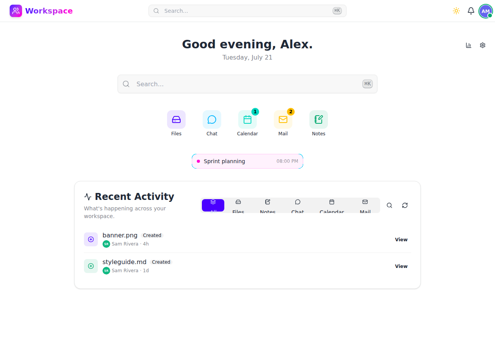
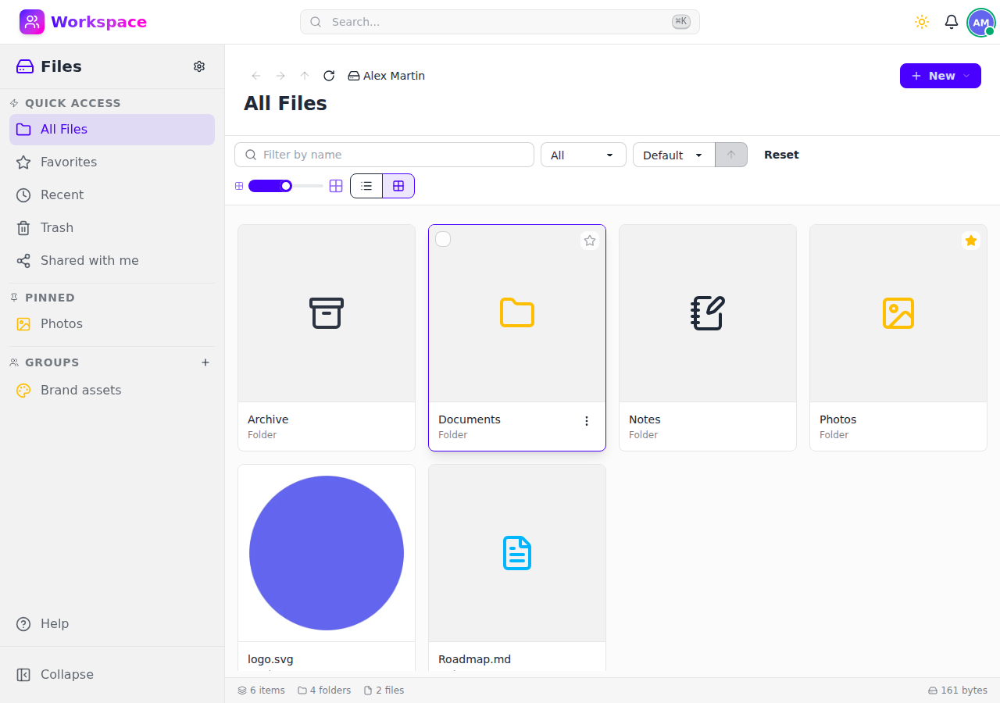
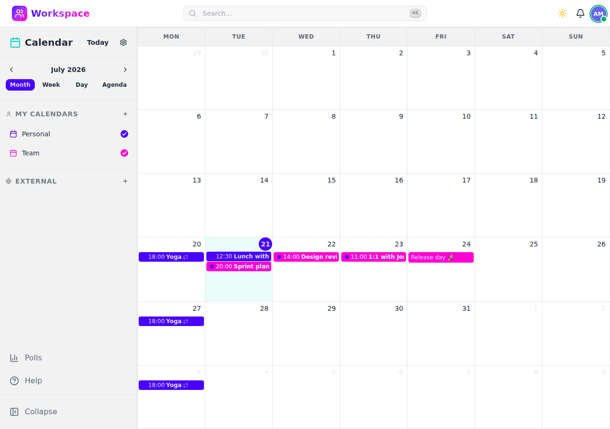
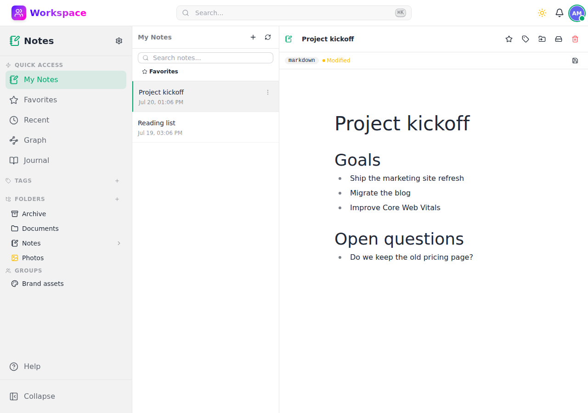

# Workspace

> **Early Development** — APIs, schemas, and features may change without notice. Use at your own risk.

A self-hosted productivity suite built with Django. Files, chat, email, calendar, AI assistants, and more — in a single platform you control.

From a Raspberry Pi to a Kubernetes cluster. One codebase, any scale.



## Features

### [Files](docs/files/)
Upload, organize, and preview files with drag & drop, folder nesting, and built-in viewers for PDF, Markdown, images, video, audio, and code. Includes favorites, trash with retention, thumbnails, mosaic view, file sharing, locking, comments, folder downloads as ZIP, and WebDAV access.



### [Chat](docs/chat/)
Direct and group messaging with real-time updates (SSE), emoji reactions, file attachments, message search, pinning, editing, read receipts, rich Markdown rendering with syntax highlighting, and AI bot integration.


### [Calendar](docs/calendar/)
Day, week, month, and agenda views. Recurring events, participants, RSVP, calendar subscriptions, scheduling polls, and iCalendar/iTIP support for email-based invitations.



### [Mail](docs/mail/)
IMAP/SMTP client with OAuth2 (Google, Microsoft), auto-discovery, compose with reply/forward, hierarchical folders, drag & drop, batch operations, contact autocomplete, and AI-powered summarization and reply suggestions.


### [Notes](docs/notes/)
Markdown editor with journal mode, folders, tags, favorites, and full-text search. Organize notes by folder or group, with a three-panel layout for quick navigation.



### AI Assistants
Configurable chat bots with system prompts, vision, function calling, extended thinking, image generation, and bot memory. Works with OpenAI API or any compatible provider (Ollama, LM Studio, etc.).

### And more
- **Notifications** — In-app + Web Push (VAPID), priority levels, read tracking
- **Dashboard** — Storage stats, recent files, conversation and event insights
- **Unified search** — Cross-module command palette (Ctrl+K) with extensible providers
- **User profiles** — Avatar upload, presence/status, per-module settings, 12 themes
- **Shareable links** — Password-protected file links with expiration

## Tech Stack

| Layer              | Technology                                                   |
|--------------------|--------------------------------------------------------------|
| **Backend**        | Django 6.0, Django REST Framework                            |
| **Frontend**       | Alpine.js, Tailwind CSS, DaisyUI, Lucide Icons               |
| **Real-time**      | Server-Sent Events (SSE)                                     |
| **Database**       | SQLite (WAL mode) or PostgreSQL                              |
| **Cache / Broker** | Redis (optional, for caching, sessions, and Celery tasks)    |
| **Task Queue**     | Celery with Redis broker, Celery Beat for periodic tasks     |
| **Server**         | Gunicorn with gevent workers, WhiteNoise, Brotli compression |
| **AI**             | OpenAI API (or any compatible provider)                      |
| **Imaging**        | Pillow, CairoSVG (thumbnail generation)                      |
| **Monitoring**     | Prometheus metrics, Kubernetes health probes                 |
| **Tooling**        | uv, Docker, drf-spectacular (OpenAPI)                        |

No build steps, no frontend framework complexity, no microservices. Just Python and templates.

## Architecture

### Simple by Default

At its core, Workspace is Django + SQLite. One Docker container, done. No database servers to manage, no infrastructure lock-in.

### Scales When You Need It

The same codebase can switch to PostgreSQL for high-concurrency workloads. The architecture supports multiple deployment strategies:

- **Personal** — Run on a VPS with SQLite, or any PaaS with persistent volumes
- **Teams** — Docker Compose, one instance per team with isolated data
- **Enterprise** — Kubernetes with PostgreSQL, SSO/LDAP, dedicated infrastructure

Instead of complex multi-tenancy with `tenant_id` columns, Workspace uses **instance-per-tenant**: true data isolation, independent scaling, and simplified security.

## Getting Started

```bash
git clone <repository-url>
cd Workspace

uv sync                          # Install dependencies
python manage.py migrate          # Run migrations
python manage.py createsuperuser  # Create admin account
python manage.py runserver        # Start dev server
```

Visit `http://localhost:8000`. No webpack, no npm, no build step.

### Prerequisites

- Python 3.14+
- [uv](https://docs.astral.sh/uv/) (recommended package manager)
- Redis (optional, for caching and Celery)

## Deployment

### Docker

```bash
docker run -d -p 8000:8000 \
  -v workspace-db:/app/db \
  -v workspace-files:/app/files \
  -e SECRET_KEY=your-secret-key-here \
  -e ALLOWED_HOSTS=yourdomain.com \
  workspace
```

Add AI by setting `AI_API_KEY` and `AI_MODEL`. Use a self-hosted LLM by pointing `AI_BASE_URL` to Ollama or LM Studio.

See [docs/deployments/](docs/deployments/) for Docker Compose and Kubernetes examples.

### Environment Variables

| Variable               | Description                                            | Default                      |
|------------------------|--------------------------------------------------------|------------------------------|
| `SECRET_KEY`           | Django secret key                                      | *required in production*     |
| `DEBUG`                | Enable debug mode                                      | `True`                       |
| `ALLOWED_HOSTS`        | Comma-separated allowed hosts                          | `*`                          |
| `CSRF_TRUSTED_ORIGINS` | Comma-separated trusted CSRF origins                   | *(none)*                     |
| `DATABASE_URL`         | Database connection string                             | `sqlite:///db.sqlite3`       |
| `REDIS_URL`            | Redis URL for cache and sessions                       | *(none, in-memory fallback)* |
| `GUNICORN_WORKERS`     | Gunicorn worker count (Docker)                         | `3`                          |
| `TRASH_RETENTION_DAYS` | Days before trashed items are permanently deleted      | `30`                         |
| `AI_API_KEY`           | OpenAI API key (or compatible provider)                | *(none, AI disabled)*        |
| `AI_BASE_URL`          | Custom LLM API base URL (Ollama, LM Studio, etc.)     | *(OpenAI default)*           |
| `AI_MODEL`             | Default LLM model                                      | `gpt-5`                      |
| `AI_MAX_TOKENS`        | Maximum tokens per AI response                         | `2048`                       |
| `AI_IMAGE_MODEL`       | Model for image generation                             | `dall-e-3`                   |
| `AI_IMAGE_BASE_URL`    | Custom image generation base URL                       | *(same as AI_BASE_URL)*      |

## API

All endpoints are prefixed with `/api/v1/` with no trailing slashes. Interactive documentation is available at:

- **Swagger UI** — `/api/v1/schema/swagger-ui/`
- **ReDoc** — `/api/v1/schema/redoc/`
- **OpenAPI Schema** — `/api/v1/schema/`

### Health Checks

- `/health/live` — Liveness probe
- `/health/ready` — Readiness probe (checks database)
- `/health/startup` — Startup probe

## Extending Workspace

Workspace is modular. Each module registers itself at startup via `AppConfig.ready()`:

```python
from workspace.core.registry import registry, ModuleInfo

class MyModuleConfig(AppConfig):
    def ready(self):
        registry.register(ModuleInfo(
            name='my_module',
            display_name='My Module',
            icon='sparkles',
            color='primary',
            url='/my-module/',
        ))
```

Your module automatically appears in the sidebar, dashboard, and search results.

## Roadmap

See [IDEAS.md](IDEAS.md) for the full roadmap. Planned modules include:

- **Tasks & Projects** — Kanban boards, sprints, time tracking
- **Contacts & CRM** — Contact management with interaction history
- **Bookmarks** — Save and organize links with automatic previews
- **Password Manager** — Encrypted vault with TOTP support

## Contributing

Contributions are welcome! Fork the repository, create a feature branch, and open a Pull Request.

By contributing, you agree to the contributor license grant in [CONTRIBUTING.md](CONTRIBUTING.md).

## License

Source-available under the [Business Source License 1.1](LICENSE) (BSL 1.1).

- Free to use, modify, and self-host for personal or internal business use.
- You may not offer Workspace as a hosted or managed service to third parties without a commercial license.
- This version converts to MIT License on 2029-03-21.
