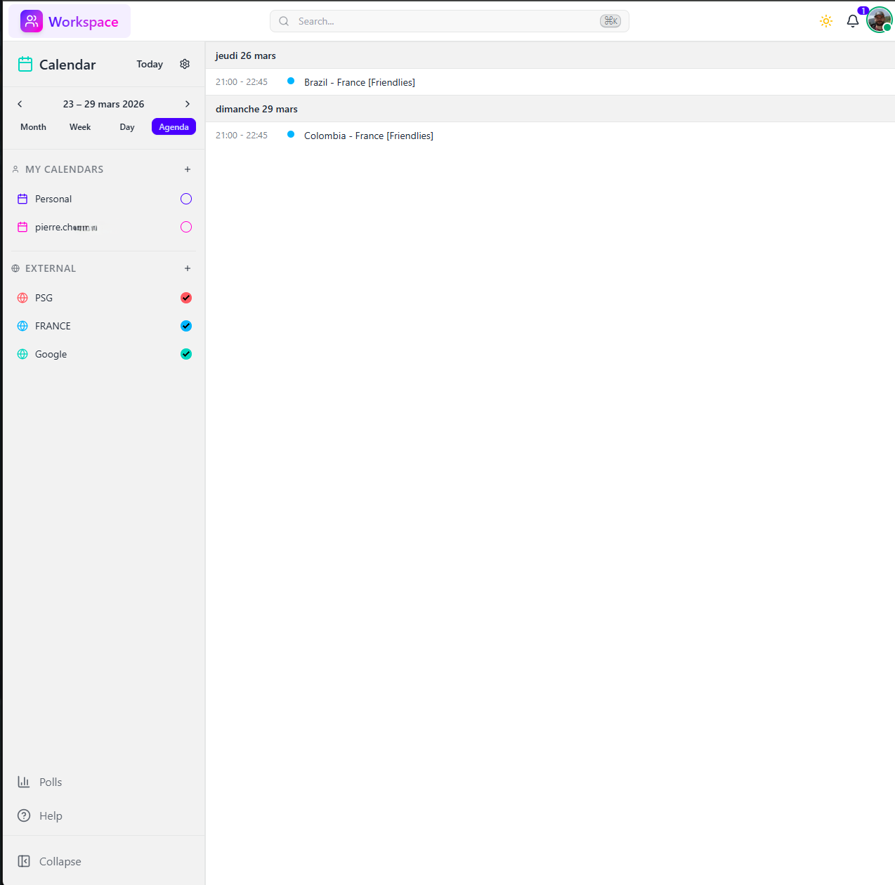

# Calendar

Day, week, month, and agenda views with recurring events, participants, and scheduling polls.

## Features

- **Multiple views** — Month, week, day, and agenda views
- **Multiple calendars** — Create and manage separate calendars with distinct colors
- **Recurring events** — Frequency rules (daily, weekly, monthly, yearly) with exceptions and edit scope (this/all/future occurrences)
- **Participants** — Invite users to events with RSVP support
- **Calendar subscriptions** — Share calendars with other users
- **External calendars** — Subscribe to external ICS feeds (Google Calendar, sports schedules, etc.) with manual or automatic sync
- **Scheduling polls** — Create polls to find the best meeting time, with guest voting support (no account required)
- **iCalendar/iTIP** — Email-based invitations following the iCalendar standard
- **All-day events** — Support for full-day and multi-day events
- **Time zone aware** — Events handled in the correct time zone

## API

All endpoints under `/api/v1/calendar/` — see the [Swagger UI](/api/v1/schema/swagger-ui/) for full documentation.
