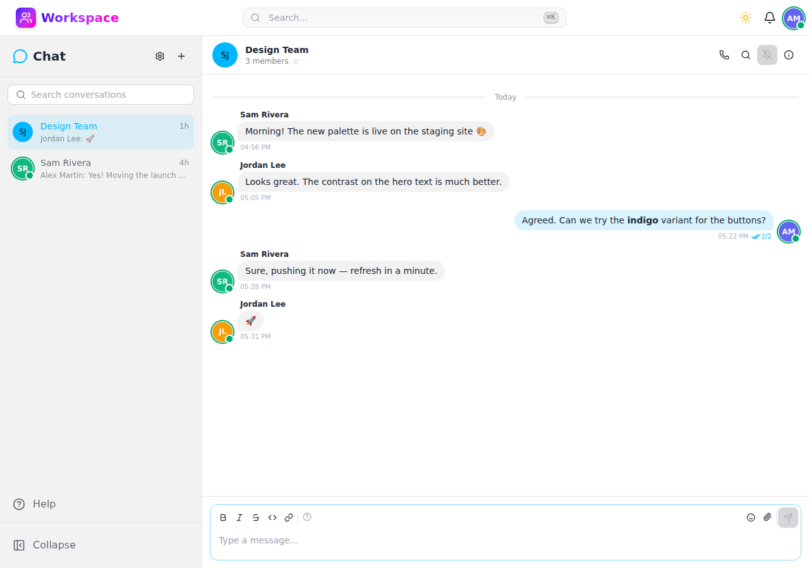

# Chat

Direct and group messaging with real-time updates, Markdown support, and AI bot integration.

## Features

- **Direct messages** — One-on-one conversations between users
- **Group conversations** — Create named groups with multiple members
- **Real-time updates** — Live message delivery via Server-Sent Events (SSE)
- **Rich Markdown** — Format messages with Markdown, including syntax-highlighted code blocks
- **Emoji reactions** — React to messages with emojis
- **File attachments** — Attach files directly to messages
- **Message search** — Search across conversation history
- **Pinning** — Pin important messages for easy reference
- **Editing** — Edit sent messages after the fact
- **Read receipts** — See who has read your messages
- **AI bot integration** — Conversational AI assistants with system prompts, vision, function calling, and memory
- **Presence indicators** — See who is online in real time

## API

All endpoints under `/api/v1/chat/` — see the [Swagger UI](/schema/swagger-ui/) for full documentation.
