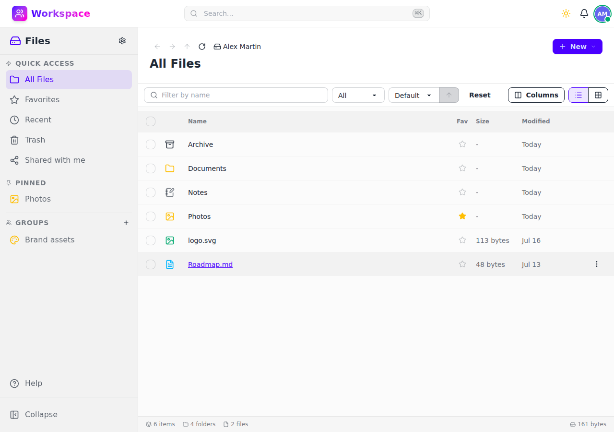

# Files

Upload, organize, and preview files with a full-featured file explorer.

## Features

- **Folder hierarchy** — Nested folders with breadcrumb navigation and path tracking
- **Multiple views** — Grid (mosaic) and list views with customizable columns
- **Drag & drop** — Upload files and move items between folders
- **Built-in viewers** — Preview PDF, Markdown, images, video, audio, and code files inline
- **Favorites & Recent** — Star files for quick access, track recently opened items
- **Trash** — Soft delete with configurable retention period before permanent removal
- **Thumbnails** — Auto-generated thumbnails for image files
- **Search** — Filter by name, file type, or MIME type with sorting options
- **Tags** — Create and assign tags to organize files across folders
- **Sharing** — Share files with specific users or via public links with optional password protection and expiration
- **Pinned folders** — Pin frequently used folders to the sidebar
- **Group folders** — Shared folder spaces for team collaboration
- **Folder download** — Download entire folders as ZIP archives
- **WebDAV** — Access files from any WebDAV-compatible client
- **File locking & comments** — Lock files to prevent concurrent edits, add comments

## API

All endpoints under `/api/v1/files/` — see the [Swagger UI](/schema/swagger-ui/) for full documentation.
