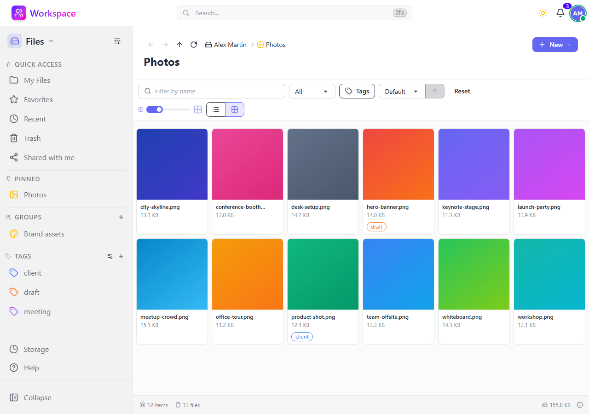
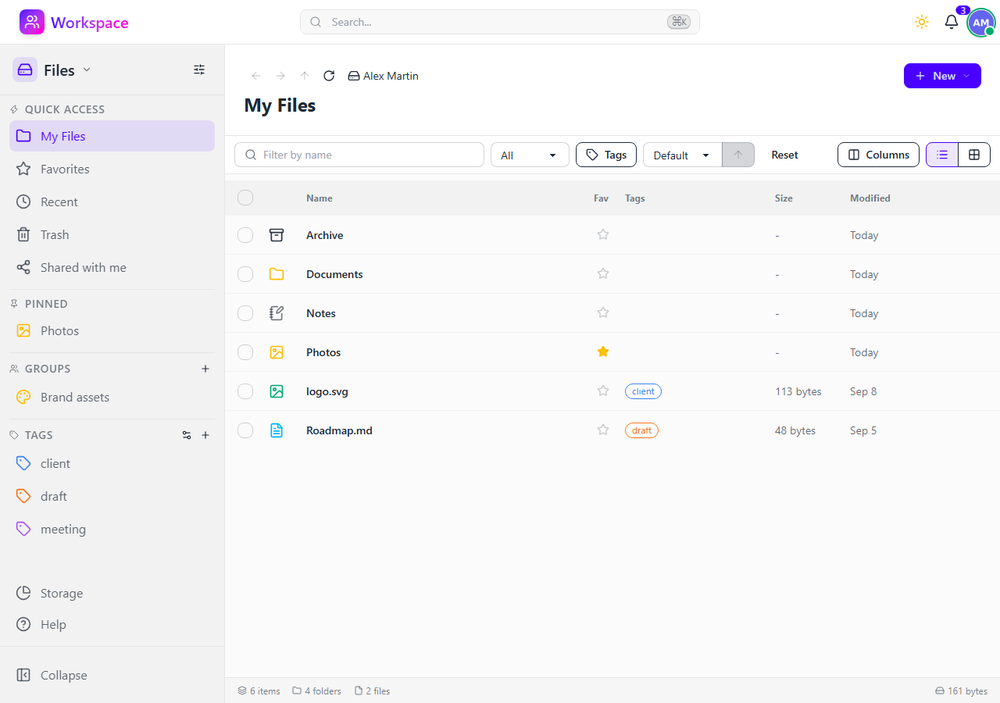

# Files

Upload, organize, and preview files with a full-featured file explorer.

## Features

- **Folder hierarchy** - Nested folders with breadcrumb navigation and path tracking
- **Multiple views** - Grid (mosaic) and list views with customizable columns
- **Drag & drop** - Upload files and move items between folders
- **Built-in viewers** - Preview PDF, Markdown, images, video, audio, and code files inline
- **Office documents** - View and edit DOCX/XLSX/PPTX in the browser through a self-hosted WOPI editor (Collabora, OnlyOffice)
- **Favorites & Recent** - Star files for quick access, track recently opened items
- **Trash** - Soft delete with configurable retention period before permanent removal
- **Thumbnails** - Auto-generated thumbnails for image files
- **Search** - Filter by name, file type, or MIME type with sorting options
- **Tags** - Create and assign tags to organize files across folders
- **Sharing** - Share files with specific users or via public links with optional password protection and expiration
- **Pinned folders** - Pin frequently used folders to the sidebar
- **Group folders** - Shared folder spaces for team collaboration
- **Folder download** - Download entire folders as ZIP archives
- **WebDAV** - Access files from any WebDAV-compatible client
- **File locking & comments** - Lock files to prevent concurrent edits, add comments

## Office Documents

Word, Excel and PowerPoint files (plus their OpenDocument equivalents: ODT, ODS, ODP) open directly in the file viewer when a WOPI editor is deployed next to the app — and users with write permission can edit and save them from the browser. Coverage follows the editor: every document-family format its discovery advertises becomes viewable (RTF, legacy binary suites, templates like DOTX, XLSB, ...), and formats the editor can only render open read-only. Without an editor, office files are download-only.

The integration speaks the WOPI protocol, so the editor is the deployer's choice:

| Editor | Notes |
|---|---|
| [Collabora CODE](https://www.collaboraonline.com/code/) | Free, single container, the setup shipped in the deployment examples |
| Collabora Online | Same protocol, commercial support |
| [OnlyOffice Docs](https://www.onlyoffice.com/) | Community or Enterprise, in WOPI mode (>= 6.4) |
| Office Online Server | Microsoft's on-premises WOPI client, for deployers licensing it |

How it behaves:

- **Permissions are live** - view-only shares open read-only, and revoking someone's access cuts their editing session at the next editor round-trip.
- **Saves are ordinary writes** - a save from the editor goes through the same pipeline as an upload: content hash, thumbnail regeneration, file events.
- **Locking is integrated** - an editing session locks the file for the rest of the app, and an in-app lock held by someone else blocks editing.
- **Graceful degradation** - editor unreachable or format unsupported → the viewer offers the download instead. Nothing else depends on the editor.

Setup lives in the deployment examples: [Docker Compose](../deployments/docker-compose/README.md#office-documents-optional) and [Kubernetes](../deployments/kubernetes/README.md#office-documents-optional). The short version: run the editor container, point `WOPI_DISCOVERY_URL` at its `/hosting/discovery` endpoint, and give the browser a route to the editor (its iframe loads from the editor's own hostname).

## API

All endpoints under `/api/v1/files/` - see the [Swagger UI](/schema/swagger-ui/) for full documentation. The WOPI endpoints used by the editor live under `/api/wopi/files/` - their shape is fixed by the [WOPI protocol](https://learn.microsoft.com/en-us/microsoft-365/cloud-storage-partner-program/rest/) and they authenticate with per-session access tokens, not user sessions.
