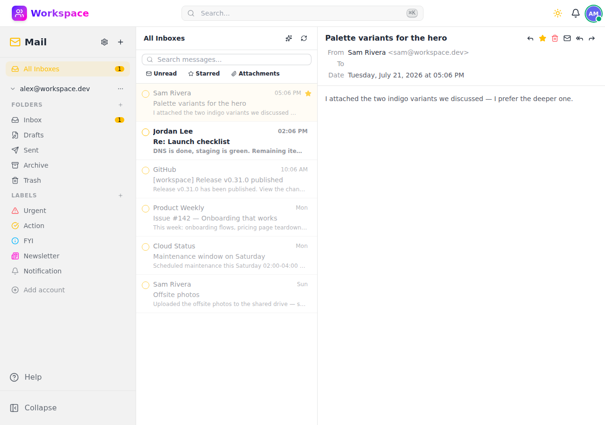

# Mail

IMAP/SMTP email client with OAuth2, AI-powered features, and full folder management.

## Features

- **Multi-account** — Connect multiple email accounts in one interface
- **IMAP/SMTP** — Full protocol support with auto-discovery of server settings
- **OAuth2** — One-click sign-in for Gmail and Microsoft 365
- **Compose** — Write, reply, and forward emails with attachments
- **Folders** — Hierarchical IMAP folder structure with sync
- **Labels** — Custom labels with colors and icons for message organization
- **Search** — Full-text message search
- **Batch operations** — Select and act on multiple messages at once
- **Drag & drop** — Move messages between folders
- **Contact autocomplete** — Suggested recipients while composing
- **AI summarization** — AI-powered email summaries and reply suggestions
- **Attachment management** — Download attachments or save them directly to the Files module
- **Read tracking** — Read/unread status with mark-all-as-read support
- **Connection testing** — Test IMAP and SMTP connectivity before saving account settings

## API

All endpoints under `/api/v1/mail/` — see the [Swagger UI](/schema/swagger-ui/) for full documentation.
