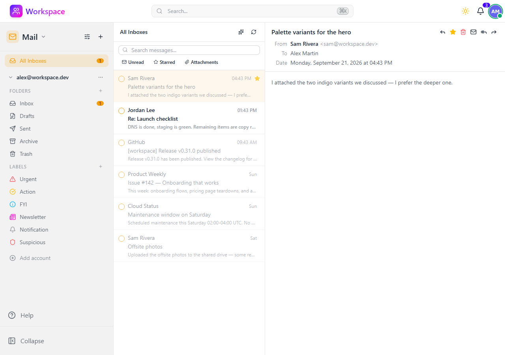

# Mail

IMAP/SMTP email client with OAuth2, AI-powered features, and full folder management.

## Features

- **Multi-account** - Connect multiple email accounts in one interface
- **IMAP/SMTP** - Full protocol support with auto-discovery of server settings
- **OAuth2** - One-click sign-in for Gmail and Microsoft 365
- **Compose** - Write, reply, and forward emails with attachments
- **Folders** - Hierarchical IMAP folder structure with sync
- **Labels** - Custom labels with colors and icons for message organization
- **Search** - Full-text message search
- **Batch operations** - Select and act on multiple messages at once
- **Drag & drop** - Move messages between folders
- **Recipient suggestions** - While composing, contacts from the People address book come first (every email of a contact is offered), then workspace accounts, then addresses from your mail history; one click adds an account or a past correspondent to your contacts
- **Contact cards** - Hovering a sender or recipient in a message shows a card: the full contact (title, organization, every email and phone) when the address is in your People address book, or an "Add to contacts" button when it is not
- **AI summarization** - AI-powered email summaries and reply suggestions
- **AI drafting and triage** - Assistants can search and read your mail, write a message or a threaded reply into Drafts for you to review, and star, file, trash or label what is in the inbox. Sending is off by default: a bot needs the send capability, and even then it shows you the message and waits for your go-ahead before anything leaves.
- **Attachment management** - Download attachments or save them directly to the Files module
- **Read tracking** - Read/unread status with mark-all-as-read support
- **Connection testing** - Test IMAP and SMTP connectivity before saving account settings

## Guides

- [Connecting a Google account](google.md) - Gmail over IMAP/SMTP, choosing between an app password and OAuth2

## API

All endpoints under `/api/v1/mail/` - see the [Swagger UI](/schema/swagger-ui/) for full documentation.
