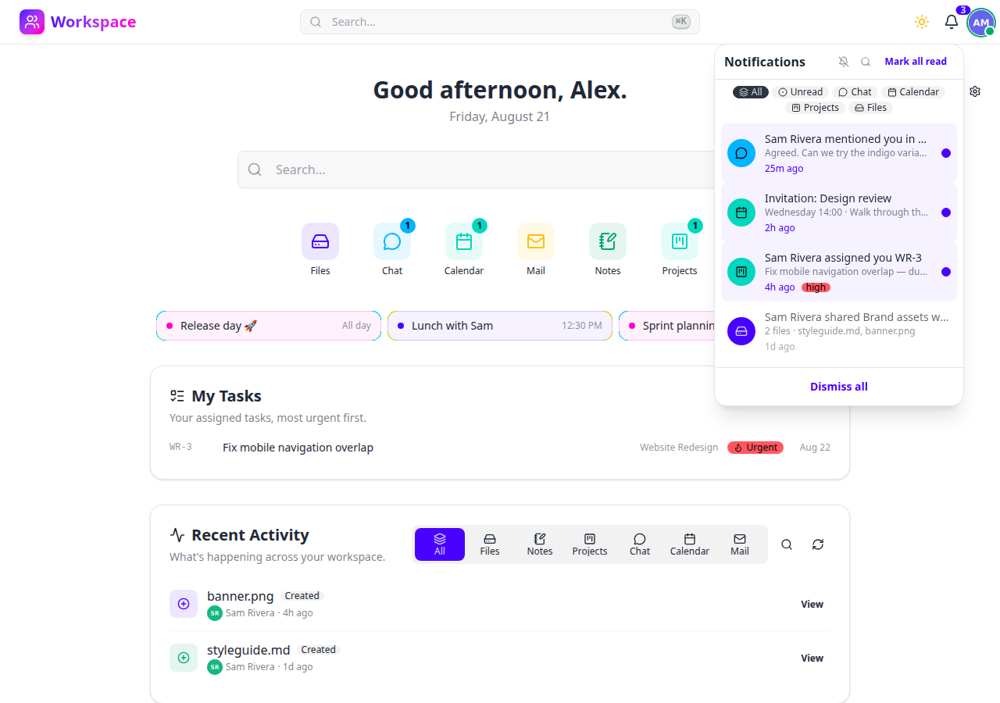

# Notifications

In-app and Web Push notifications with priority levels and read tracking.

## Features

- **In-app notifications** - A notification center with an unread badge, delivered live so the badge updates without a page reload.
- **Web Push** - Browser push notifications via the Web Push protocol (VAPID), so users are reached even when the app is closed. Users subscribe per device.
- **Priority levels** - `low`, `normal`, `high`, and `urgent`, so important notifications stand out.
- **Rich metadata** - Each notification carries an icon, color, title, body, optional deep-link URL, and an optional actor (the user who triggered it).
- **Read tracking** - Per-notification read state with a mark-all-as-read action; the unread badge is backed by a partial index for fast counts.
- **Cross-module origins** - Any module can raise a notification (a new chat message, a file share, a calendar invite, ...) tagged with its origin for filtering.

## Web Push setup

Web Push is optional and disabled until VAPID keys are configured. Generate a key pair with `python manage.py generate_vapid_keys` and set:

| Variable | Purpose |
|---|---|
| `WEBPUSH_VAPID_PRIVATE_KEY` | VAPID private key |
| `WEBPUSH_VAPID_PUBLIC_KEY` | VAPID public key (sent to the browser) |
| `WEBPUSH_VAPID_MAILTO` | Contact `mailto:` address required by the push protocol |

The private key is accepted as raw base64url (what the command prints), base64url DER, or a PEM block. The single-line form is the safest choice: `.env` files and container env vars handle multi-line values inconsistently.

The public key is what the browser stores as its `applicationServerKey`, so **regenerating the pair invalidates every existing subscription** and all users must re-subscribe. Rotate only when you mean to.

Push delivery runs as background work, so **Celery worker should be running in production** for reliable delivery. When pushes never arrive, check the worker log first: a key that cannot be parsed, a missing `WEBPUSH_VAPID_MAILTO`, and a push service rejecting the request are each reported there.

## API

All endpoints under `/api/v1/notifications/` - see the [Swagger UI](/schema/swagger-ui/) for full documentation.
