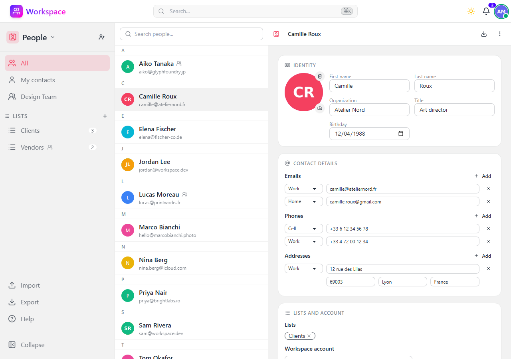

# People

An address book for the people around your data: personal and group contacts, lists, linked workspace accounts, and vCard import/export.

## Features

- **Contact cards** - Name, organization, title, birthday, several emails, phones and postal addresses (each with a type), free-form notes, and a photo
- **Address books** - Your own contacts, visible to you alone, plus one shared book per group you belong to, visible to every member of that group
- **Lists** - Gather contacts of one address book into named lists (family, clients, a team); deleting a list never deletes its contacts
- **Linked accounts** - Link a contact to a workspace account so the card shows that account's picture and name
- **Move between books** - Move a contact from your personal book to a group book, or back, from its Actions menu
- **vCard import** - Import a `.vcf` file from a phone, Google Contacts or Nextcloud; a contact already in the book (same card or same email) is updated rather than duplicated, and vCard groups become lists
- **vCard export** - Download one contact, a list, an address book or everything as a vCard 4.0 file, photos included
- **Search** - Search by name, organization, email or phone as you type, and jump to a contact from the command palette (Ctrl+K)
- **Three-panel layout** - Address books and lists in the sidebar, an alphabetical contact list in the middle, and the contact's card on the right

## Address books and lists

A contact belongs to exactly one address book: **My contacts**, or one of your groups. Pick the book in the sidebar to narrow the list; **All** shows every contact you can reach. Anyone who can see a book can edit its contacts, there are no per-book roles.

A list belongs to the same book as its members, so a group list only accepts that group's contacts. Create a list with the **+** next to the Lists heading, rename or delete it from its row menu, and add a contact to it from the contact's panel. A group icon on a row marks a list that belongs to a group's book.

## Importing and exporting

**Import** takes a `.vcf` file and the address book it goes in. Cards are matched to existing contacts first by their vCard UID, then by email, so re-importing an updated export refreshes the contacts instead of duplicating them. Properties the app has no field for are kept and written back on export, so a card survives a round trip through Workspace intact.

**Export** produces a vCard 4.0 file for a phone, Google Contacts or Nextcloud. The export dialog lets you pick the open contact, a list, one address book or everything; a list is exported as a vCard group referencing its members.

## Extending a contact's card

Other modules can add a section to the contact panel through the section registry in `workspace/people/sections.py`: register a `PersonSection` (label, icon, template, optional visibility rule) from the module's `AppConfig.ready()` and it renders below the built-in cards. A section whose template or visibility rule fails is skipped and logged, never taking the page down.

## API

All endpoints under `/api/v1/people` - see the [Swagger UI](/schema/swagger-ui/) for full documentation.

| Endpoint | Purpose |
|---|---|
| `/api/v1/people` | List, search (`q`, `scope`, `list`), create, update, and delete contacts |
| `/api/v1/people/<uuid>/avatar` | Get, upload (with crop), and delete a contact's photo |
| `/api/v1/people/actions` | Actions available to the current user on one or more contacts |
| `/api/v1/people/lists` | Create, rename, and delete lists |
| `/api/v1/people/lists/<uuid>/members` | Add and remove list members |
| `/api/v1/people/import` | Import a `.vcf` file into an address book |
| `/api/v1/people/export` | Download contacts as vCard (`person`, `list`, or `scope` filter) |
