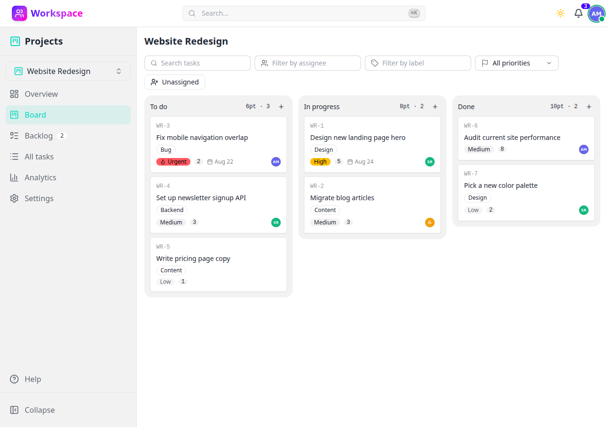
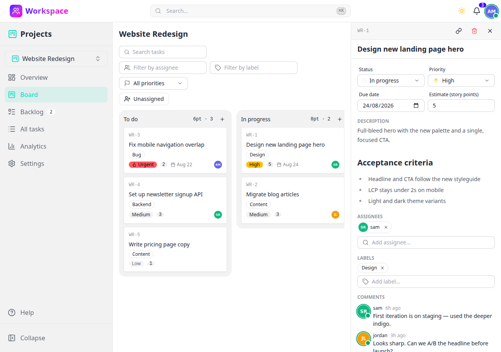

# Projects

Kanban boards for tracking tasks, solo or as a team.

## Features

- **Personal project** - Every user gets a private project out of the box, ready to use without any setup
- **Shared projects** - Create additional projects and invite people as Admin or Member
- **Groups** - Attach groups to a project so every group member gets access; admin rights always stay individual
- **Four views** - Overview (counts and recent activity), Board (kanban columns), Backlog (unplanned work), and All tasks (flat list)
- **Drag & drop** - Move cards between columns or reorder them within a column
- **Custom columns** - Add, rename, recolor, and reorder columns; each one is a Backlog, Active, or Done column
- **Task details** - Markdown description, status, priority, due date, assignees, labels, comments, and per-task activity in a side panel
- **Priorities** - Low, Medium, High, and Urgent, with urgency-aware sorting
- **Labels** - A shared, color-coded label palette per project
- **Task references** - Every task gets a stable reference like `WR-42`, usable to look the task up from search or to deep-link it with `?task=WR-42`
- **Filters** - Narrow any view by text, assignee, priority, or label
- **Comments** - Discuss a task inline, with editing and deletion
- **Activity feed** - Task creations, updates, moves, completions, deletions, and comments, per project and in the profile feed
- **Done retention** - Choose how long completed tasks stay visible on the board; hidden tasks remain in counts, search, and links
- **Archiving** - Archive a project to make it read-only instead of deleting it
- **Search** - Full-text search over project and task names and descriptions, plus direct lookup by reference or task number, from the command palette (Ctrl+K)
- **Dashboard integration** - Assigned tasks appear in the dashboard "My tasks" widget, with a badge for work that is due today or overdue

## Roles and access

| Role | Granted by | Can do |
|---|---|---|
| Admin | An individual membership with the `admin` role | Everything a member can, plus project settings, columns, labels, members, groups, archiving, and deletion |
| Member | An individual membership, or membership of an attached group | View the project and create, edit, move, comment on, and delete tasks |

Group access never grants admin rights - promote someone through a project membership instead. Access checks go through `workspace.projects.queries.user_project_ids`, and the available actions for a project or task are served by `POST /api/v1/projects/actions`.

## Task references

Each project owns a short uppercase key (`WR`, `PERS`, ...), derived from its name when it is created and unique app-wide. Tasks are numbered per project from a counter that is never reset, so a reference like `WR-42` identifies one task forever - numbers are not reused when a task is deleted. Typing a reference (or a bare task number) in the command palette jumps straight to the task, and a reference works in the deep-link query parameter too: `/projects/<uuid>?task=WR-42`.

## API

All endpoints under `/api/v1/projects` - see the [Swagger UI](/schema/swagger-ui/) for full documentation.

| Endpoint | Purpose |
|---|---|
| `/api/v1/projects` | List, create, update, and delete projects |
| `/api/v1/projects/actions` | Actions available to the current user on a project or task |
| `/api/v1/projects/<uuid>/members` | Manage members and roles |
| `/api/v1/projects/<uuid>/labels` | Manage the label palette |
| `/api/v1/projects/<uuid>/statuses` | Manage and reorder columns |
| `/api/v1/projects/<uuid>/tasks` | List and create tasks; `reorder` and `move` for board operations |
| `/api/v1/projects/<uuid>/tasks/<uuid>/comments` | Task comments |
